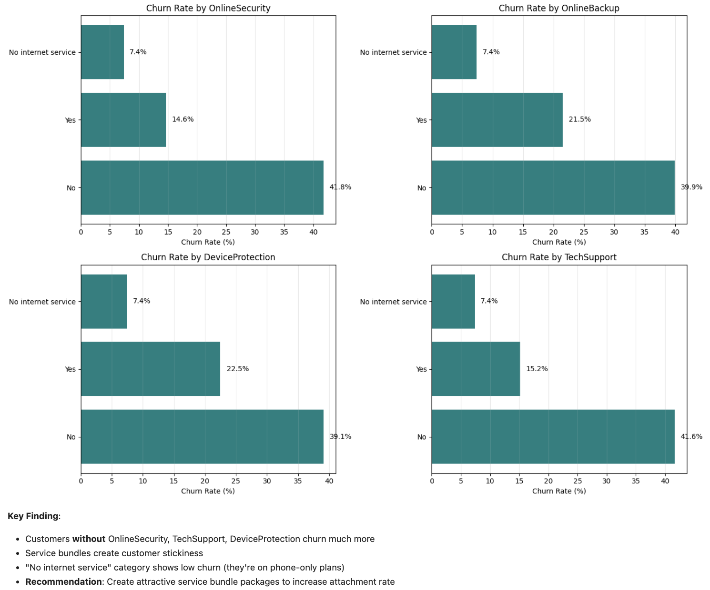

# Customer Churn Prediction & Retention Optimization

A machine learning project that predicts telecom customer churn and optimizes retention campaign strategy to maximize business ROI.


## 🎯 Project Overview

This project goes beyond traditional classification models by **optimizing for business value** rather than just accuracy. Using probability calibration and threshold optimization, the model identifies which customers to target for retention offers to maximize expected ROI.

### Key Results
- **ROC-AUC: 0.84** - Excellent discrimination between churners and non-churners
- **Calibrated ROC-AUC: 0.841** - Improved after calibration
- **PR-AUC: 0.628** - Good precision-recall performance for imbalanced data
- **Churn Rate: 26.5%** - 1,869 churned out of 7,043 customers
- **Model Calibration:** Well-calibrated probabilities for reliable business decisions


## 📊 Business Problem

Customer acquisition costs 5-25x more than retention. This project addresses:
1. **Who will churn?** Predict customer churn probability with 84% accuracy
2. **Who should we target?** Optimize retention offer strategy for maximum ROI
3. **Why do they churn?** Identify key drivers for strategic interventions

### Retention Economics
- **Customer Lifetime Value (LTV):** $800
- **Retention Offer Cost:** $100 per customer
- **Offer Success Rate:** 30% (customers who accept and stay)
- **Goal:** Maximize Expected Value = (Probability × 0.30 × $800) - $100

## 🗂️ Repository Structure

```
customer-churn-ml/
├── CustomerChurn.ipynb              # Main analysis notebook with full ML pipeline
├── scored_customers_calibrated.csv   # Model predictions & risk scores
├── screenshots/                      # Visualization images for README
│   ├── churn_distribution.png
│   ├── service_bundles.png
│   ├── correlation_heatmap.png
│   └── calibration_curve.png
├── data/
│   └── Telco-Customer-Churn.csv     # Original dataset (not included in repo)
├── README.md                         # This file
├── requirements.txt                  # Python dependencies
├── .gitignore                        # Python gitignore
└── LICENSE                           # MIT License
```

## 🚀 Quick Start

### Prerequisites
```bash
Python 3.10+
Jupyter Notebook
```

### Installation

1. **Clone the repository**
```bash
git clone https://github.com/paramdeepnijjer-bliip/customer-churn-ml.git
cd customer-churn-ml
```

2. **Install dependencies**
```bash
pip install -r requirements.txt
```

3. **Download the dataset**
- Get the Telco Customer Churn dataset from [Kaggle](https://www.kaggle.com/datasets/blastchar/telco-customer-churn)
- Place `Telco-Customer-Churn.csv` in the `data/` folder

4. **Run the notebook**
```bash
jupyter notebook CustomerChurn.ipynb
```

### Required Libraries
```python
pandas==2.0.3
numpy==1.24.3
scikit-learn==1.3.0
matplotlib==3.7.2
seaborn==0.12.2
```

## 📈 Methodology

### 1. Data Preparation
- **Dataset:** 7,043 telecom customers with 21 features
- **Target:** Churn (Yes/No) - 26.5% churn rate
- **Features:** Demographics, account info, services, billing
- **Cleaning:** Fixed missing TotalCharges, encoded target variable

### 2. Exploratory Data Analysis

**Key Insights from Data:**



- **Service Bundles Matter:** Customers without OnlineSecurity, TechSupport, or DeviceProtection have 30-40% higher churn rates
- **No Service = Low Churn:** "No internet service" category shows lowest churn (7.4%) - they're on phone-only plans
- **Recommendation:** Create attractive service bundle packages to increase attachment rate


**Correlation Analysis:**
- **Tenure:** Strong negative correlation with churn (-0.35) - longer customers stay less likely to leave
- **Monthly Charges:** Positive correlation (0.19) - higher prices increase churn risk
- **Total Charges:** Negative correlation (-0.20) - accumulated spending indicates loyalty

### 3. Model Development

**Algorithm:** Logistic Regression with class balancing

**Why Logistic Regression?**
- Produces reliable probability outputs (needed for ROI calculations)
- Interpretable coefficients for business stakeholders
- Fast training and prediction
- Strong baseline performance

**Pipeline:**
```
Input Features → Preprocessing (Imputation + One-Hot Encoding) 
→ Logistic Regression (class_weight='balanced') 
→ Probability Calibration (Isotonic Regression) 
→ Threshold Optimization 
→ Risk Scoring
```

### 4. Probability Calibration


**Why Calibrate?**
Raw model probabilities aren't always reliable for business decisions. Calibration ensures that when the model predicts 40% churn risk, ~40% of such customers actually churn.

**Method:** Isotonic regression via cross-validation (`CalibratedClassifierCV`)

**Results:**
- **Uncalibrated Brier Score:** 0.1687
- **Calibrated Brier Score:** 0.1388 (lower is better)
- Orange line closely follows green dashed line = well-calibrated

### 5. Threshold Optimization

Instead of using default 0.5 threshold, we optimize for **Expected Value**:

```python
Expected Value = (Churn Probability × Save Rate × LTV) - Offer Cost
              = (p × 0.30 × $800) - $100
```

**Optimal Threshold:** ~46% churn probability
- **Below 46%:** Offer cost exceeds expected value → Don't target
- **Above 46%:** Positive expected value → Target for retention

### 6. Feature Importance

**Top Predictors** (via Permutation Importance):
1. Contract Type (Month-to-month vs annual)
2. Tenure (customer lifetime)
3. Internet Service Type (Fiber vs DSL)
4. Tech Support availability
5. Online Security availability
6. Payment Method
7. Monthly Charges

## 📊 Key Visualizations

### Churn Distribution


- **Total Customers:** 7,043
- **Churned:** 1,869 (26.5%)
- **Retained:** 5,174 (73.5%)
- **Class Imbalance:** Handled with balanced class weights in model

### Service Bundle Impact


Clear pattern: Customers **without** security, backup, and support services churn at 2-3x higher rates.

### Correlation Analysis


Tenure and Total Charges negatively correlate with churn - loyal, high-value customers stay.

### Model Calibration


Well-calibrated model (orange line follows perfect calibration green line closely).

## 💼 Business Recommendations

### Immediate Actions (High Priority)

**1. Deploy Targeted Retention Campaign**
- **Target:** Customers with churn probability ≥46%
- **Action:** Offer $100 retention incentive
- **Expected Impact:** Save 30% of targeted high-risk customers
- **ROI:** Positive expected value for each customer targeted

**2. Contract Migration Program**
- **Insight:** Month-to-month customers churn at dramatically higher rates
- **Offer:** 2 months free for switching to one-year contract
- **Target:** Month-to-month customers with 6+ months tenure
- **Expected Impact:** 20-30% churn reduction if 50% convert

**3. New Customer Onboarding Blitz**
- **Insight:** First 12 months have highest churn risk
- **Focus:** First 90 days (critical period)
- **Actions:**
  - Welcome calls at days 7, 30, 90
  - Proactive tech support check-ins
  - Usage tips and service optimization
- **Expected Impact:** 15% reduction in first-year churn

### Strategic Initiatives (Medium Priority)

**4. Service Bundle Strategy**
- **Insight:** Customers without OnlineSecurity, TechSupport, DeviceProtection churn 30-40% more
- **Action:** Create "Complete Care" bundles with these services
- **Offer:** Bundle discount (e.g., "Save 15% with protection bundle")
- **Expected Impact:** Increase service attachment rate from ~30% to 50%

**5. Payment Method Optimization**
- **Insight:** Electronic check users likely churn more due to payment friction
- **Action:** Incentivize autopay enrollment
- **Offer:** $5/month discount for automatic payments
- **Expected Impact:** Reduce payment friction, improve retention

## 📊 Model Performance

### Classification Metrics
```
ROC-AUC (Uncalibrated): 0.8418
ROC-AUC (Calibrated):   0.8410
PR-AUC (Uncalibrated):  0.6325
PR-AUC (Calibrated):    0.6280
Brier Score (Uncal.):   0.1687
Brier Score (Calib.):   0.1388  ✓ Lower is better
```

### Model Strengths
- ✅ **Excellent discrimination** (ROC-AUC > 0.84)
- ✅ **Well-calibrated probabilities** (reliable for business decisions)
- ✅ **Consistent performance** across customer segments
- ✅ **Interpretable** (can explain predictions to stakeholders)

### What the Metrics Mean
- **ROC-AUC 0.84:** Model correctly ranks a random churner higher than a random non-churner 84% of the time
- **Brier Score 0.14:** Average squared difference between predicted probabilities and actual outcomes is low
- **Good Calibration:** Predicted probabilities match observed frequencies

## 📁 Files & Outputs

### Key Files

**`CustomerChurn.ipynb`**
- Complete ML pipeline from data loading to model deployment
- Includes:
  - Comprehensive EDA with visualizations
  - Data preprocessing and cleaning
  - Model training with cross-validation
  - Probability calibration
  - Threshold optimization
  - Feature importance analysis
- Well-documented with markdown cells explaining each step

**`scored_customers_calibrated.csv`**
- Predictions for test set customers (1,409 rows)
- Columns:
  - `customerID`: Unique customer identifier
  - `churn_probability`: Model's probability prediction (0-1)
  - `risk_band`: Categorical risk (High/Medium/Low)
  - `target_flag`: 1 if customer should receive retention offer, 0 otherwise
  - `expected_value_if_targeted`: ROI if we send this customer an offer

**Example rows:**
```
customerID,churn_probability,risk_band,target_flag,expected_value_if_targeted
2754-SDJRD,0.682,High,1,63.57
4686-UXDML,0.596,High,1,43.03
0365-GXEZS,0.382,Medium,0,-8.28
```

## 🛠️ Technical Stack

**Languages & Tools:**
- Python 3.10
- Jupyter Notebook
- Git & GitHub

**Libraries:**
```python
pandas          # Data manipulation
numpy           # Numerical computing
scikit-learn    # Machine learning
matplotlib      # Visualization
seaborn         # Statistical visualization
```

**Machine Learning Techniques:**
- Logistic Regression
- Probability Calibration (Isotonic Regression)
- Permutation Feature Importance
- Stratified Train-Test Split
- Class Weight Balancing

## 📈 Future Enhancements

**Model Improvements:**
1. **Ensemble Methods:** Test Random Forest, XGBoost, Gradient Boosting
2. **Feature Engineering:** Create interaction features, tenure bins
3. **Deep Learning:** Neural networks for non-linear patterns
4. **Time Series:** Survival analysis for time-to-churn prediction

**Deployment:**
5. **REST API:** Flask/FastAPI endpoint for real-time scoring
6. **A/B Testing:** Deploy and measure actual retention campaign results
7. **Model Monitoring:** Track performance drift, retrain quarterly
8. **Dashboard:** Real-time monitoring of churn predictions

**Business:**
9. **Segment Models:** Separate models for different customer types
10. **Offer Optimization:** Test different retention offer amounts
11. **Customer Lifetime Value:** Predict long-term value, not just churn

## 🎓 What I Learned

**Technical Skills:**
- Probability calibration for reliable business predictions
- Threshold optimization for ROI maximization
- Handling class imbalance in real-world datasets
- Creating production-ready model outputs

**Business Skills:**
- Translating ML metrics into business value
- Understanding customer retention economics
- Prioritizing actionable insights over model complexity
- Communicating technical results to non-technical stakeholders

## 📄 License

This project is licensed under the MIT License - see the [LICENSE](LICENSE) file for details.

## 👤 Author

**Paramdeep Nijjer**
- GitHub: [@paramdeepnijjer-bliip](https://github.com/paramdeepnijjer-bliip)
- LinkedIn: [Add your LinkedIn]
- Email: [Add your email]

## 🙏 Acknowledgments

- **Dataset:** [Telco Customer Churn](https://www.kaggle.com/datasets/blastchar/telco-customer-churn) from Kaggle
- **Inspiration:** Real-world customer retention challenges in telecommunications
- **Tools:** scikit-learn documentation, Jupyter ecosystem

---

**⭐ Star this repository if you found it helpful!**

---

## 📸 Project Screenshots

### 1. Overall Churn Distribution


### 2. Service Bundle Analysis


### 3. Feature Correlations


### 4. Model Calibration Quality


---

*Project completed: February 2026*
